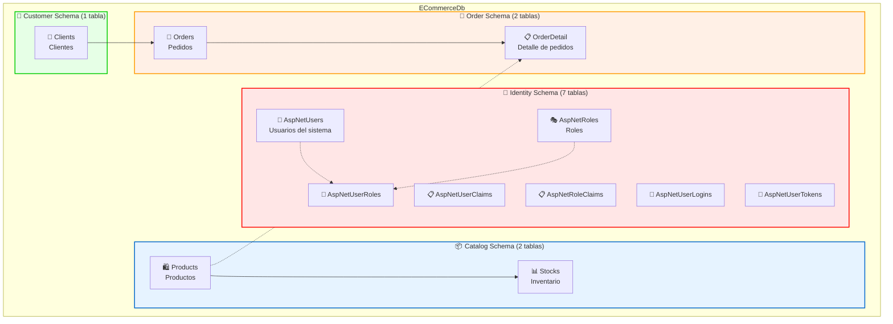
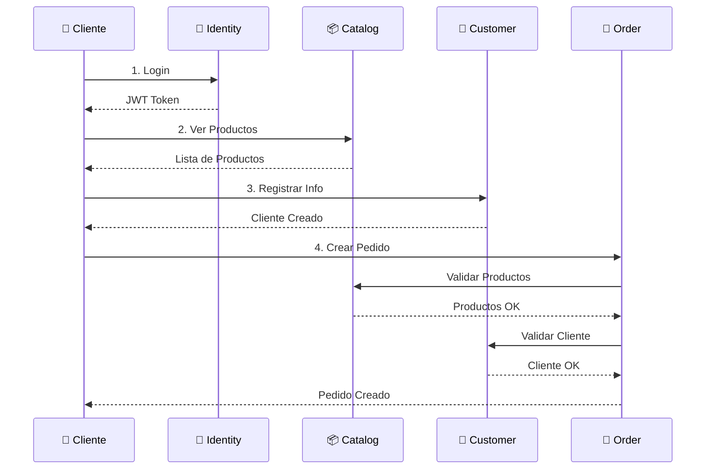
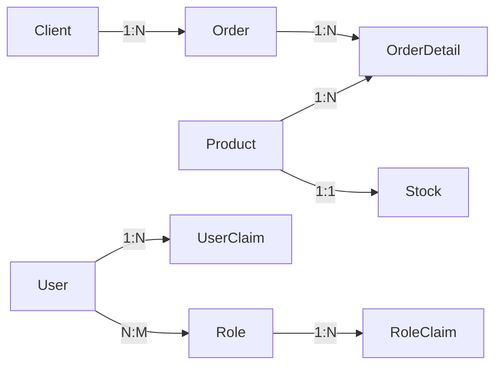
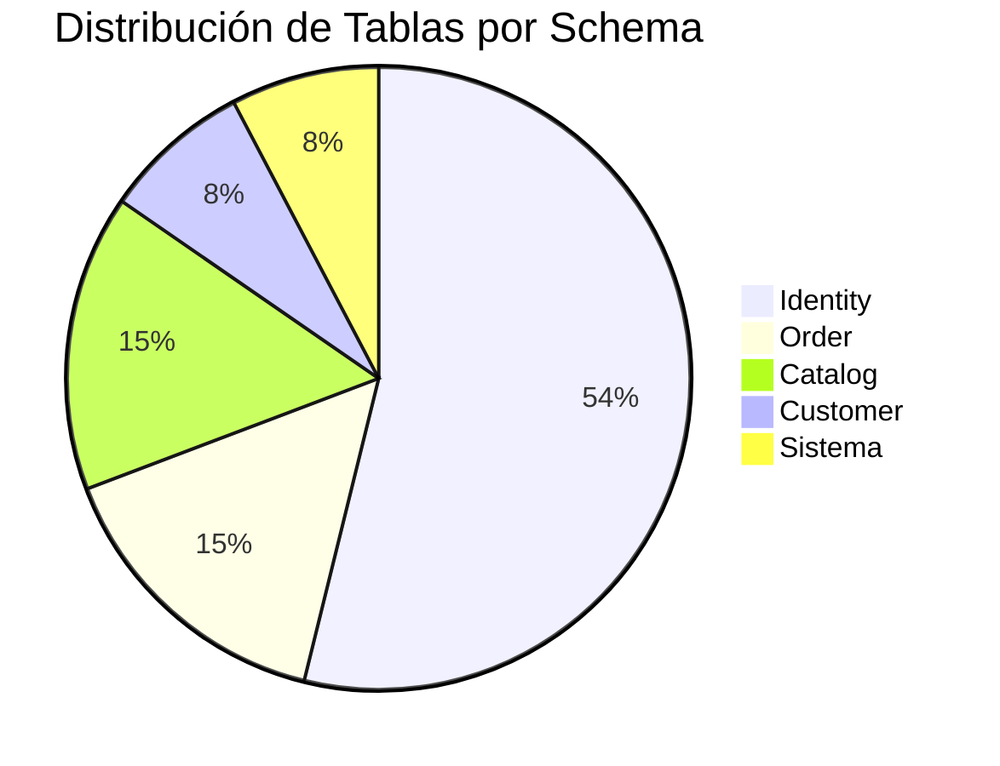

# 🎨 Visualización Rápida de la Base de Datos

## 📊 Vista Simplificada de Esquemas



## 🔄 Flujo de Datos Principal



## 📋 Tabla Resumen por Schema

| Schema | Icono | Tablas | Propósito | Puerto API |
|--------|-------|--------|-----------|------------|
| **Identity** | 🔐 | 7 | Autenticación y Autorización | :10000 |
| **Catalog** | 📦 | 2 | Gestión de Productos | :20000 |
| **Customer** | 👥 | 1 | Gestión de Clientes | :30000 |
| **Order** | 🛒 | 2 | Gestión de Pedidos | :40000 |

## 🗂️ Estructura de Tablas Detallada

### 🔐 Identity Schema

```
AspNetUsers (Tabla Principal)
├── Id (PK)
├── UserName
├── Email
├── PasswordHash
├── FirstName
├── LastName
└── ... (11 campos más)
    │
    ├──→ AspNetUserRoles (Relación con Roles)
    ├──→ AspNetUserClaims (Claims del Usuario)
    ├──→ AspNetUserLogins (Logins Externos)
    └──→ AspNetUserTokens (Tokens)

AspNetRoles
├── Id (PK)
├── Name
└──→ AspNetRoleClaims (Claims del Rol)
```

### 📦 Catalog Schema

```
Products
├── ProductId (PK)
├── Name
├── Description
├── Price
└──→ Stocks (1:1)
    └── Stock (cantidad)
```

### 👥 Customer Schema

```
Clients
├── ClientId (PK)
├── Name
├── Email
└── Phone
```

### 🛒 Order Schema

```
Orders
├── OrderId (PK)
├── ClientId (FK → Clients)
├── CreatedAt
├── Status
├── Total
└──→ OrderDetail (1:N)
    ├── OrderDetailId (PK)
    ├── OrderId (FK)
    ├── ProductId (FK → Products)
    ├── Quantity
    ├── UnitPrice
    └── Total
```

## 🎯 Cardinalidades



**Leyenda:**
- `1:1` = Uno a Uno
- `1:N` = Uno a Muchos
- `N:M` = Muchos a Muchos

## 📊 Métricas de la Base de Datos



## 🔍 Queries de Ejemplo

### Obtener pedidos de un cliente con detalles
```sql
SELECT 
    c.Name AS Cliente,
    o.OrderId,
    o.CreatedAt,
    o.Status,
    od.Quantity,
    p.Name AS Producto,
    od.UnitPrice,
    od.Total
FROM [Customer].Clients c
INNER JOIN [Order].Orders o ON c.ClientId = o.ClientId
INNER JOIN [Order].OrderDetail od ON o.OrderId = od.OrderId
INNER JOIN [Catalog].Products p ON od.ProductId = p.ProductId
WHERE c.ClientId = 1;
```

### Productos con bajo stock
```sql
SELECT 
    p.ProductId,
    p.Name,
    p.Price,
    s.Stock
FROM [Catalog].Products p
INNER JOIN [Catalog].Stocks s ON p.ProductId = s.ProductId
WHERE s.Stock < 10
ORDER BY s.Stock ASC;
```

### Usuarios con roles
```sql
SELECT 
    u.UserName,
    u.Email,
    r.Name AS Role
FROM [Identity].AspNetUsers u
INNER JOIN [Identity].AspNetUserRoles ur ON u.Id = ur.UserId
INNER JOIN [Identity].AspNetRoles r ON ur.RoleId = r.Id;
```

## 🎨 Convenciones de Nombres

### Schemas
- ✅ PascalCase: `Identity`, `Catalog`, `Customer`, `Order`
- ✅ Singular para representar el dominio

### Tablas
- ✅ PascalCase: `Products`, `Orders`, `Clients`
- ✅ Plural cuando representa colecciones
- ✅ Singular para tablas de relación: `OrderDetail`

### Columnas
- ✅ PascalCase: `ProductId`, `FirstName`, `CreatedAt`
- ✅ Sufijo `Id` para claves primarias
- ✅ Nombres descriptivos

## 🔗 Enlaces Rápidos

- [📊 Esquema Completo](./DATABASE_SCHEMA.md)
- [✅ Verificación de Conexión](./DATABASE_CONNECTION_VERIFIED.md)
- [🔄 Historial de Migraciones](./DATABASE_MIGRATION_COMPLETE.md)

---

**Última actualización:** 2025-10-04  
**Base de datos:** ECommerceDb  
**Servidor:** localhost\SQLEXPRESS
