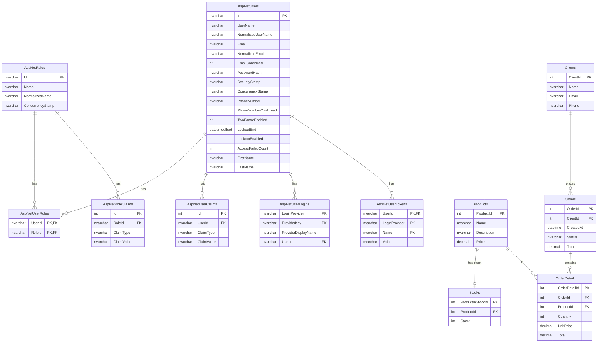
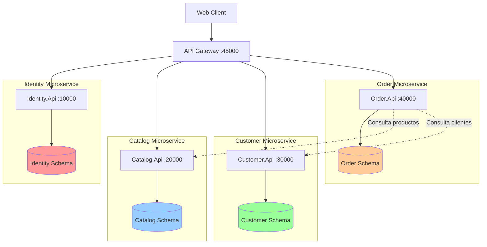
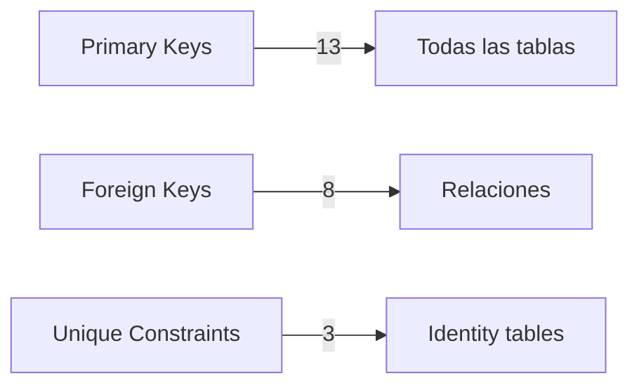

# 🗄️ Esquema de Base de Datos - ECommerceDb

## 📊 Diagrama Entidad-Relación



## 🏗️ Arquitectura por Esquemas

### 🔐 Identity Schema
**Propósito:** Gestión de autenticación y autorización de usuarios

| Tabla | Descripción | Registros Iniciales |
|-------|-------------|---------------------|
| `AspNetUsers` | Usuarios del sistema | 1 (admin@gmail.com) |
| `AspNetRoles` | Roles de usuario | 0 |
| `AspNetUserRoles` | Relación usuarios-roles | 0 |
| `AspNetUserClaims` | Claims personalizados de usuarios | 0 |
| `AspNetRoleClaims` | Claims de roles | 0 |
| `AspNetUserLogins` | Logins externos (Google, Facebook, etc.) | 0 |
| `AspNetUserTokens` | Tokens de autenticación | 0 |

### 📦 Catalog Schema
**Propósito:** Gestión del catálogo de productos

| Tabla | Descripción | Campos Principales |
|-------|-------------|-------------------|
| `Products` | Productos disponibles | ProductId, Name, Description, Price |
| `Stocks` | Inventario de productos | ProductInStockId, ProductId, Stock |

**Relación:** Un producto tiene un registro de stock (1:1)

### 👥 Customer Schema
**Propósito:** Gestión de clientes

| Tabla | Descripción | Campos Principales |
|-------|-------------|-------------------|
| `Clients` | Información de clientes | ClientId, Name, Email, Phone |

### 🛒 Order Schema
**Propósito:** Gestión de pedidos y ventas

| Tabla | Descripción | Campos Principales |
|-------|-------------|-------------------|
| `Orders` | Pedidos realizados | OrderId, ClientId, CreatedAt, Status, Total |
| `OrderDetail` | Detalle de cada pedido | OrderDetailId, OrderId, ProductId, Quantity, UnitPrice, Total |

**Relaciones:**
- Un cliente puede tener múltiples pedidos (1:N)
- Un pedido contiene múltiples detalles (1:N)
- Un producto puede estar en múltiples detalles (1:N)

## 📈 Diagrama de Arquitectura Microservicios



## 🔗 Relaciones Entre Microservicios

### Order → Catalog
- **Propósito:** Validar productos y obtener precios
- **Método:** HTTP API calls
- **Endpoint:** GET /api/products/{id}

### Order → Customer
- **Propósito:** Validar información del cliente
- **Método:** HTTP API calls
- **Endpoint:** GET /api/clients/{id}

### Identity → Todos
- **Propósito:** Autenticación y autorización
- **Método:** JWT Token validation
- **Flujo:** Todos los servicios validan tokens generados por Identity

## 📊 Estadísticas de la Base de Datos

### Resumen por Schema

| Schema | Tablas | Tipo |
|--------|--------|------|
| **Identity** | 7 | Sistema (ASP.NET Core Identity) |
| **Catalog** | 2 | Negocio |
| **Customer** | 1 | Negocio |
| **Order** | 2 | Negocio |
| **dbo** | 1 | Sistema (EF Migrations) |
| **TOTAL** | **13** | - |

### Índices y Claves



## 🔐 Datos Iniciales

### Usuario Administrador
```sql
Email: admin@gmail.com
Password: Pa$$w0rd!
FirstName: Admin
LastName: Administrator
EmailConfirmed: true
```

## 🛠️ Comandos Útiles

### Ver todas las tablas por schema
```sql
SELECT 
    s.name AS [Schema], 
    t.name AS [Table],
    (SELECT COUNT(*) FROM sys.columns WHERE object_id = t.object_id) AS [Columns]
FROM sys.tables t 
INNER JOIN sys.schemas s ON t.schema_id = s.schema_id 
ORDER BY s.name, t.name;
```

### Ver relaciones (Foreign Keys)
```sql
SELECT 
    fk.name AS ForeignKey,
    OBJECT_NAME(fk.parent_object_id) AS TableName,
    COL_NAME(fkc.parent_object_id, fkc.parent_column_id) AS ColumnName,
    OBJECT_NAME(fk.referenced_object_id) AS ReferencedTable,
    COL_NAME(fkc.referenced_object_id, fkc.referenced_column_id) AS ReferencedColumn
FROM sys.foreign_keys AS fk
INNER JOIN sys.foreign_key_columns AS fkc 
    ON fk.object_id = fkc.constraint_object_id
ORDER BY TableName;
```

### Ver índices por tabla
```sql
SELECT 
    OBJECT_SCHEMA_NAME(i.object_id) AS SchemaName,
    OBJECT_NAME(i.object_id) AS TableName,
    i.name AS IndexName,
    i.type_desc AS IndexType
FROM sys.indexes i
WHERE i.object_id IN (SELECT object_id FROM sys.tables)
    AND i.name IS NOT NULL
ORDER BY SchemaName, TableName, IndexName;
```

## 📚 Documentación Relacionada

- [DATABASE_CONNECTION_VERIFIED.md](./DATABASE_CONNECTION_VERIFIED.md) - Verificación de conexión
- [DATABASE_MIGRATION_COMPLETE.md](./DATABASE_MIGRATION_COMPLETE.md) - Proceso de migración
- [MIGRATION_TO_NET9.md](./MIGRATION_TO_NET9.md) - Migración a .NET 9
- [README.md](./README.md) - Documentación principal

## 🔄 Actualizaciones del Schema

**Última actualización:** 2025-10-04  
**Versión:** 1.0  
**Estado:** ✅ Producción

---

**Conexión:**
```
Server=localhost\SQLEXPRESS;Database=ECommerceDb;Trusted_Connection=True;MultipleActiveResultSets=true;TrustServerCertificate=True
```
