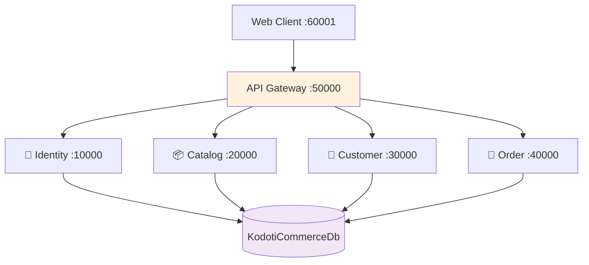
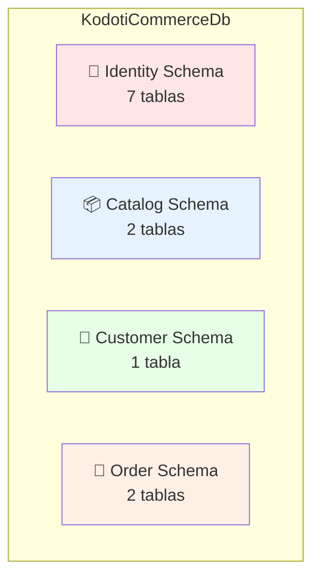
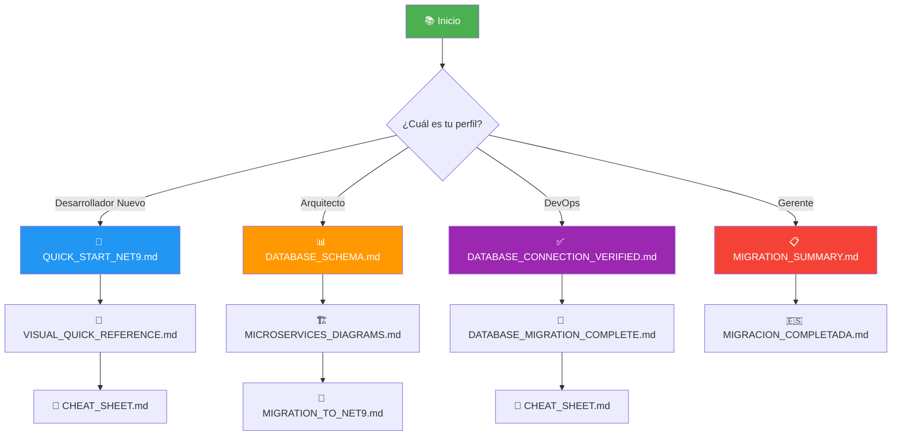
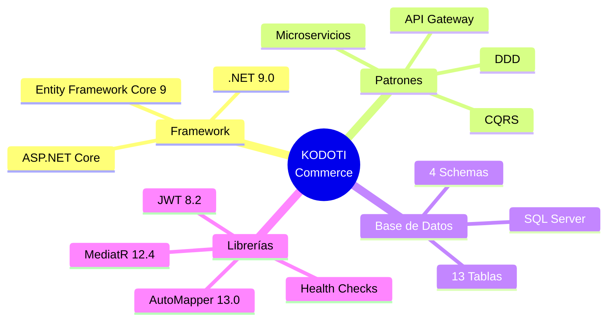
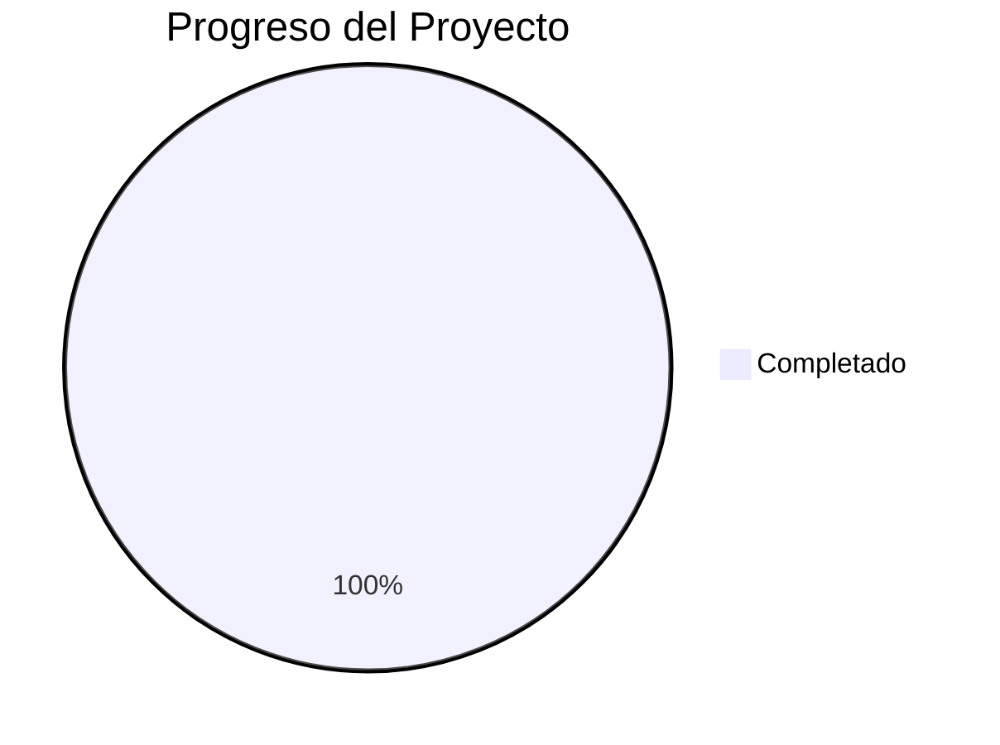

# 📚 Documentación Visual - KODOTI Commerce

> **Sistema de E-Commerce con Arquitectura de Microservicios en .NET 9**

## 🎯 Navegación Rápida

<table>
<tr>
<td width="33%" align="center">
<h3>🚀 Empezar</h3>
<a href="./QUICK_START_NET9.md">

</a>
<br/>
<small>Configuración y ejecución en minutos</small>
</td>
<td width="33%" align="center">
<h3>📊 Base de Datos</h3>
<a href="./DATABASE_SCHEMA.md">

</a>
<br/>
<small>Diagramas ER y estructura completa</small>
</td>
<td width="33%" align="center">
<h3>🏗️ Arquitectura</h3>
<a href="./MICROSERVICES_DIAGRAMS.md">

</a>
<br/>
<small>Flujos y comunicación entre servicios</small>
</td>
</tr>
</table>

## 📖 Índice de Documentación

### 🎓 Para Empezar

| Documento | Descripción | Nivel |
|-----------|-------------|-------|
| 📘 [README.md](./README.md) | Documentación principal | 🟢 Básico |
| ⚡ [QUICK_START_NET9.md](./QUICK_START_NET9.md) | Guía de inicio rápido | 🟢 Básico |
| 🎨 [VISUAL_QUICK_REFERENCE.md](./VISUAL_QUICK_REFERENCE.md) | Referencia visual rápida | 🟢 Básico |
| 🔧 [CHEAT_SHEET.md](./CHEAT_SHEET.md) | Comandos útiles | 🟡 Intermedio |

### 🗄️ Base de Datos

| Documento | Contenido | Audiencia |
|-----------|-----------|-----------|
| 📊 [DATABASE_SCHEMA.md](./DATABASE_SCHEMA.md) | Diagrama ER completo + relaciones | 🔵 Arquitectos |
| 🎨 [DATABASE_DIAGRAM.md](./DATABASE_DIAGRAM.md) | Diagramas simplificados | 🟢 Todos |
| ✅ [DATABASE_CONNECTION_VERIFIED.md](./DATABASE_CONNECTION_VERIFIED.md) | Verificación de conexión | 🟡 DevOps |
| 📜 [DATABASE_MIGRATION_COMPLETE.md](./DATABASE_MIGRATION_COMPLETE.md) | Historial de migraciones | 🟡 Desarrolladores |

### 🏗️ Arquitectura

| Documento | Enfoque | Nivel |
|-----------|---------|-------|
| 🔧 [MICROSERVICES_DIAGRAMS.md](./MICROSERVICES_DIAGRAMS.md) | Detalles por microservicio | 🔴 Avanzado |
| 📑 [DOCUMENTATION_INDEX.md](./DOCUMENTATION_INDEX.md) | Índice completo | 🟢 Todos |

### 🔄 Migración a .NET 9

| Documento | Tipo | Audiencia |
|-----------|------|-----------|
| 📋 [MIGRATION_SUMMARY.md](./MIGRATION_SUMMARY.md) | Resumen ejecutivo | 👔 Gerencia |
| 📝 [MIGRATION_TO_NET9.md](./MIGRATION_TO_NET9.md) | Técnico detallado | 👨‍💻 Desarrolladores |
| 🇪🇸 [MIGRACION_COMPLETADA.md](./MIGRACION_COMPLETADA.md) | Resumen en español | 🌎 Equipo |

## 🎨 Vista Previa de Diagramas

### Arquitectura de Microservicios



**[Ver diagramas completos →](./MICROSERVICES_DIAGRAMS.md)**

### Esquema de Base de Datos



**[Ver esquema completo →](./DATABASE_SCHEMA.md)**

## 🎯 Mapa de Navegación



## 🔍 Búsqueda Rápida

### Por Tipo de Información

| Necesito... | Ver documento |
|-------------|---------------|
| 🎯 **Empezar rápidamente** | [QUICK_START_NET9.md](./QUICK_START_NET9.md) |
| 📊 **Ver tablas y relaciones** | [DATABASE_SCHEMA.md](./DATABASE_SCHEMA.md) |
| 🏗️ **Entender arquitectura** | [MICROSERVICES_DIAGRAMS.md](./MICROSERVICES_DIAGRAMS.md) |
| 💻 **Comandos útiles** | [CHEAT_SHEET.md](./CHEAT_SHEET.md) |
| 🎨 **Vista visual rápida** | [VISUAL_QUICK_REFERENCE.md](./VISUAL_QUICK_REFERENCE.md) |
| ✅ **Verificar conexión DB** | [DATABASE_CONNECTION_VERIFIED.md](./DATABASE_CONNECTION_VERIFIED.md) |
| 📝 **Detalles de migración** | [MIGRATION_TO_NET9.md](./MIGRATION_TO_NET9.md) |
| 🗺️ **Índice completo** | [DOCUMENTATION_INDEX.md](./DOCUMENTATION_INDEX.md) |

### Por Tema

<table>
<tr>
<td>

**🗄️ Base de Datos**
- [Esquema completo](./DATABASE_SCHEMA.md)
- [Diagramas visuales](./DATABASE_DIAGRAM.md)
- [Verificación](./DATABASE_CONNECTION_VERIFIED.md)
- [Migraciones](./DATABASE_MIGRATION_COMPLETE.md)

</td>
<td>

**🏗️ Arquitectura**
- [Microservicios](./MICROSERVICES_DIAGRAMS.md)
- [Índice](./DOCUMENTATION_INDEX.md)
- [Vista rápida](./VISUAL_QUICK_REFERENCE.md)

</td>
<td>

**🔄 Migración**
- [Resumen](./MIGRATION_SUMMARY.md)
- [Técnico](./MIGRATION_TO_NET9.md)
- [Español](./MIGRACION_COMPLETADA.md)

</td>
</tr>
</table>

## 📊 Estadísticas del Proyecto

<table>
<tr>
<td align="center">
<h3>36</h3>
<small>Proyectos<br/>Migrados</small>
</td>
<td align="center">
<h3>100%</h3>
<small>Compilación<br/>Exitosa</small>
</td>
<td align="center">
<h3>4/4</h3>
<small>Tests<br/>Pasando</small>
</td>
<td align="center">
<h3>13</h3>
<small>Tablas<br/>Creadas</small>
</td>
<td align="center">
<h3>4</h3>
<small>Microservicios<br/>Activos</small>
</td>
</tr>
</table>

## 🛠️ Stack Tecnológico



## 🚀 Quick Links

### Inicio Rápido (3 pasos)

1. **📥 Clonar y Configurar**
   ```bash
   git clone https://github.com/MiltonMolloja/ECommerceMicroserviceArchitecture.git
   cd ECommerceMicroserviceArchitecture
   ```

2. **🗄️ Configurar Base de Datos**
   - Conexión: `Server=localhost\SQLEXPRESS;Database=KodotiCommerceDb;...`
   - Ver: [DATABASE_CONNECTION_VERIFIED.md](./DATABASE_CONNECTION_VERIFIED.md)

3. **▶️ Ejecutar Servicios**
   ```bash
   # Identity
   cd src/Services/Identity/Identity.Api && dotnet run
   
   # Catalog
   cd src/Services/Catalog/Catalog.Api && dotnet run
   
   # Customer
   cd src/Services/Customer/Customer.Api && dotnet run
   
   # Order
   cd src/Services/Order/Order.Api && dotnet run
   ```

### Credenciales de Prueba

```
📧 Email:    admin@kodoti.com
🔑 Password: Pa$$w0rd!
```

### Health Checks

- ✅ http://localhost:10000/hc - Identity
- ✅ http://localhost:20000/hc - Catalog
- ✅ http://localhost:30000/hc - Customer
- ✅ http://localhost:40000/hc - Order

## 📚 Recursos Adicionales

### Cursos y Tutoriales

- 🎓 [Curso en Udemy](https://www.udemy.com/course/microservicios-con-net-core-3-hasta-su-publicacion-en-azure/)
- 🌐 [Anexsoft](https://anexsoft.com)

### Documentación Microsoft

- [.NET 9 Docs](https://docs.microsoft.com/dotnet/)
- [EF Core 9 Docs](https://docs.microsoft.com/ef/)
- [ASP.NET Core Identity](https://docs.microsoft.com/aspnet/core/security/authentication/identity)

### Herramientas

- [Visual Studio 2022](https://visualstudio.microsoft.com/)
- [VS Code](https://code.visualstudio.com/)
- [SQL Server Express](https://www.microsoft.com/sql-server/sql-server-downloads)
- [.NET 9 SDK](https://dotnet.microsoft.com/download/dotnet/9.0)

## ✨ Características Destacadas

- ✅ **Arquitectura Limpia** - Separación clara de responsabilidades
- ✅ **CQRS con MediatR** - Comandos y queries separados
- ✅ **Microservicios Independientes** - Cada servicio con su propia base de datos
- ✅ **API Gateway** - Punto único de entrada
- ✅ **JWT Authentication** - Seguridad robusta
- ✅ **Health Checks** - Monitoreo integrado
- ✅ **Documentación Completa** - Más de 10 documentos con diagramas
- ✅ **Diagramas Mermaid** - Visualización en GitHub

## 🎉 Estado Actual



- ✅ Migración a .NET 9: **100%**
- ✅ Compilación: **Sin errores**
- ✅ Tests: **4/4 pasando**
- ✅ Base de Datos: **Configurada**
- ✅ Documentación: **Completa**

## 💬 Soporte

¿Tienes preguntas? Consulta la documentación:

1. 📖 [Índice Completo](./DOCUMENTATION_INDEX.md)
2. 🎨 [Referencia Visual](./VISUAL_QUICK_REFERENCE.md)
3. 🔧 [Cheat Sheet](./CHEAT_SHEET.md)

---

<p align="center">
  <strong>KODOTI Commerce - E-Commerce con Microservicios en .NET 9</strong><br/>
  <sub>Última actualización: 2025-10-04 | Versión: .NET 9.0</sub>
</p>

<p align="center">
  <a href="./README.md">🏠 Inicio</a> •
  <a href="./DOCUMENTATION_INDEX.md">📑 Índice</a> •
  <a href="./QUICK_START_NET9.md">⚡ Quick Start</a> •
  <a href="./DATABASE_SCHEMA.md">📊 Base de Datos</a> •
  <a href="./MICROSERVICES_DIAGRAMS.md">🏗️ Arquitectura</a>
</p>
