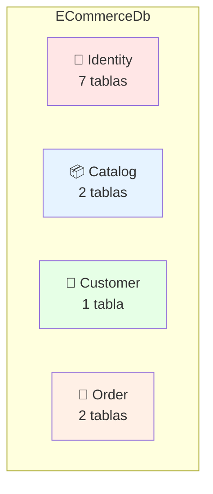
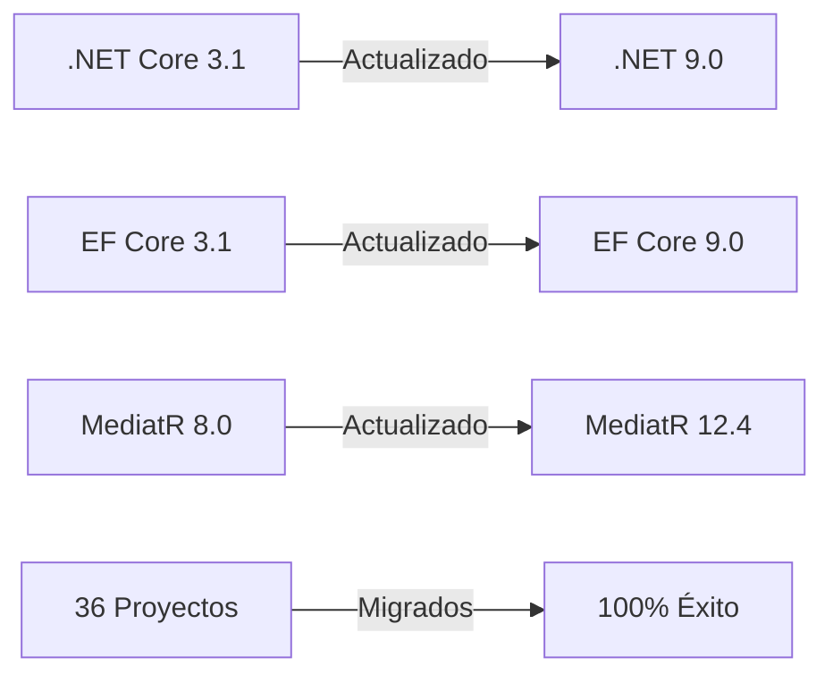
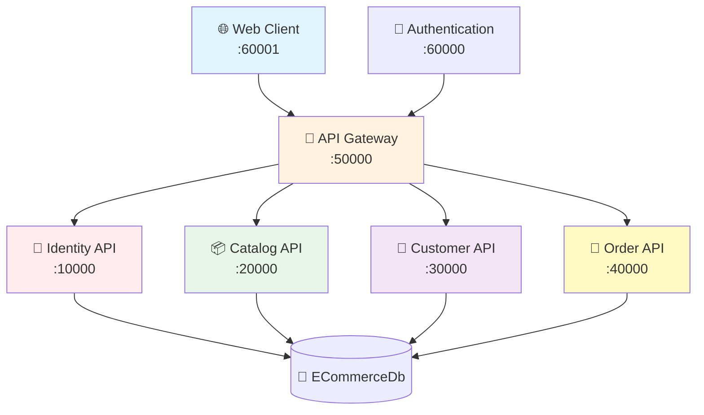
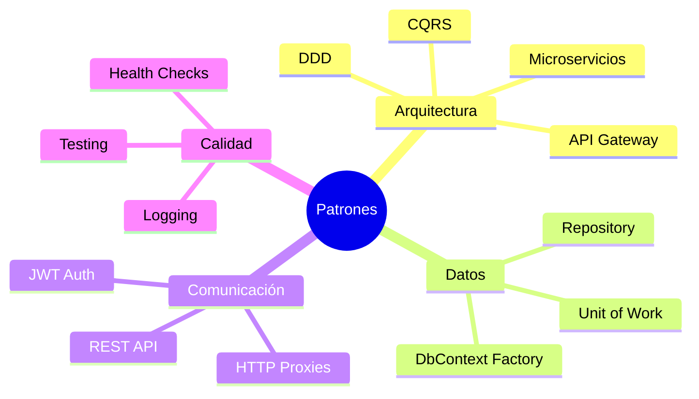
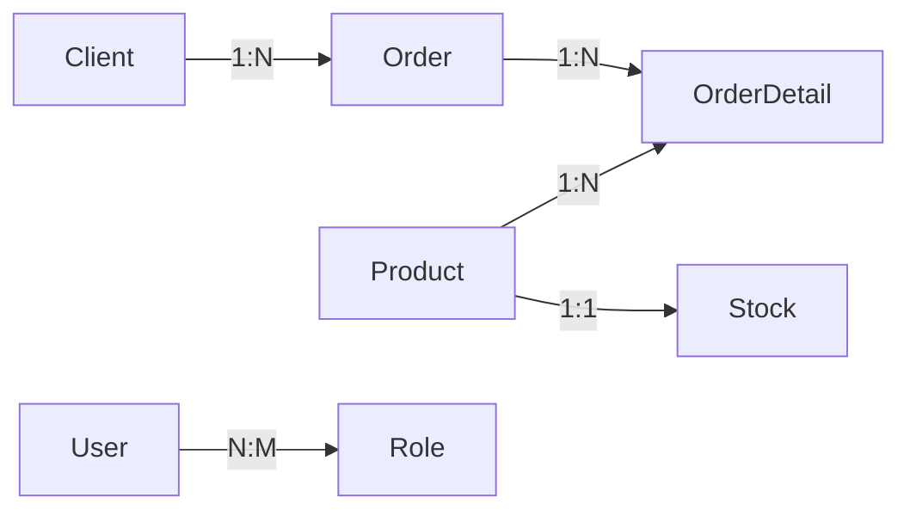
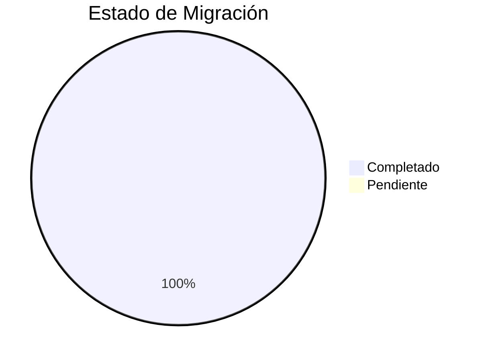

# 📚 Índice de Documentación - ECommerce

Bienvenido a la documentación completa del proyecto ECommerce con arquitectura de microservicios en .NET 9.

## 🚀 Inicio Rápido

| Documento | Descripción | Ideal Para |
|-----------|-------------|------------|
| [README.md](./README.md) | Documentación principal del proyecto | 🌟 **Comenzar aquí** |
| [QUICK_START_NET9.md](./QUICK_START_NET9.md) | Guía paso a paso para ejecutar el proyecto | 👨‍💻 Desarrolladores nuevos |
| [VISUAL_QUICK_REFERENCE.md](./VISUAL_QUICK_REFERENCE.md) | 🎨 Acceso rápido a todos los diagramas | 👁️ Vista rápida |
| [CHEAT_SHEET.md](./CHEAT_SHEET.md) | 🔧 Comandos útiles y referencias | 💻 Referencia diaria |

## 🗄️ Mapas de Base de Datos

| Documento | Tipo | Descripción | Vista Previa |
|-----------|------|-------------|--------------|
| **[DATABASE_SCHEMA.md](./DATABASE_SCHEMA.md)** | 📊 Completo | Diagrama ER completo con todas las tablas y relaciones | ⭐ **Recomendado** |
| **[DATABASE_DIAGRAM.md](./DATABASE_DIAGRAM.md)** | 🎨 Visual | Diagramas simplificados y flujos de datos | 🎯 Rápida referencia |

## 🏗️ Arquitectura de Microservicios

| Documento | Tipo | Descripción |
|-----------|------|-------------|
| **[MICROSERVICES_DIAGRAMS.md](./MICROSERVICES_DIAGRAMS.md)** | 🔧 Detallado | Diagramas completos de cada microservicio, flujos y comunicación entre servicios |

### 📊 Vista Previa del Esquema



**Contenido de los mapas:**
- ✅ Diagramas ER en formato Mermaid (se ven en GitHub)
- ✅ Relaciones entre tablas
- ✅ Arquitectura de microservicios
- ✅ Flujos de datos
- ✅ Queries de ejemplo
- ✅ Cardinalidades (1:1, 1:N, N:M)

## 🔄 Migración a .NET 9

| Documento | Audiencia | Contenido |
|-----------|-----------|-----------|
| [MIGRATION_SUMMARY.md](./MIGRATION_SUMMARY.md) | 📊 Gerencia/PM | Resumen ejecutivo, cambios principales |
| [MIGRATION_TO_NET9.md](./MIGRATION_TO_NET9.md) | 👨‍💻 Desarrolladores | Documentación técnica detallada |
| [MIGRACION_COMPLETADA.md](./MIGRACION_COMPLETADA.md) | 🇪🇸 Equipo (ES) | Resumen completo en español |

### ¿Qué incluye la migración?



## 🗄️ Base de Datos

| Documento | Tipo | Contenido |
|-----------|------|-----------|
| [DATABASE_CONNECTION_VERIFIED.md](./DATABASE_CONNECTION_VERIFIED.md) | ✅ Verificación | Configuración y prueba de conexión |
| [DATABASE_MIGRATION_COMPLETE.md](./DATABASE_MIGRATION_COMPLETE.md) | 📜 Historial | Migraciones aplicadas y estado |

### Información de Conexión

```
Servidor: localhost\SQLEXPRESS
Base de Datos: ECommerceDb
Autenticación: Windows (Trusted_Connection)
Usuario Admin: admin@gmail.com / Pa$$w0rd!
```

## 🏗️ Arquitectura del Proyecto

### Estructura de Microservicios



### Distribución de Proyectos

| Categoría | Cantidad | Ubicación |
|-----------|----------|-----------|
| 🎯 APIs | 4 | `src/Services/*/**.Api` |
| 💾 Persistencia | 4 | `src/Services/*/**.Persistence.Database` |
| 🏛️ Dominio | 4 | `src/Services/*/**.Domain` |
| 🔍 Queries | 4 | `src/Services/*/**.Service.Queries` |
| ⚡ Event Handlers | 4 | `src/Services/*/**.Service.EventHandlers` |
| 🚪 Gateways | 4 | `src/Gateways/**` |
| 🌐 Clientes | 2 | `src/Clients/**` |
| 🔧 Común | 5 | `src/Common/**` |
| 🧪 Tests | 1 | `src/Services/Catalog/Catalog.Tests` |
| **TOTAL** | **36** | Proyectos migrados |

## 🔧 Tecnologías Utilizadas

### Framework y Librerías

| Tecnología | Versión Anterior | Versión Actual | Propósito |
|------------|------------------|----------------|-----------|
| .NET | Core 3.1 | 9.0 | Framework principal |
| Entity Framework Core | 3.1.1 | 9.0.0 | ORM |
| ASP.NET Core Identity | 3.1.1 | 9.0.0 | Autenticación |
| MediatR | 8.0.0 | 12.4.1 | CQRS Pattern |
| AutoMapper | 9.0.0 | 13.0.1 | Object Mapping |
| JWT Bearer | 5.6.0 | 8.2.1 | Autenticación JWT |
| Health Checks | 3.0.9 | 8.0.2 | Monitoreo |

### Patrones de Diseño Implementados



## 📊 Esquemas de Base de Datos

### Resumen por Schema

| Schema | Icono | Tablas | Microservicio | Puerto |
|--------|-------|--------|---------------|--------|
| Identity | 🔐 | 7 | Identity.Api | 10000 |
| Catalog | 📦 | 2 | Catalog.Api | 20000 |
| Customer | 👥 | 1 | Customer.Api | 30000 |
| Order | 🛒 | 2 | Order.Api | 40000 |

### Relaciones Principales



## 🚀 Cómo Usar Esta Documentación

### Para Desarrolladores Nuevos

1. **Comenzar aquí:** [README.md](./README.md)
2. **Configurar entorno:** [QUICK_START_NET9.md](./QUICK_START_NET9.md)
3. **Entender la DB:** [DATABASE_DIAGRAM.md](./DATABASE_DIAGRAM.md)
4. **Verificar conexión:** [DATABASE_CONNECTION_VERIFIED.md](./DATABASE_CONNECTION_VERIFIED.md)

### Para Arquitectos/Tech Leads

1. **Visión general:** [MIGRATION_SUMMARY.md](./MIGRATION_SUMMARY.md)
2. **Esquema completo:** [DATABASE_SCHEMA.md](./DATABASE_SCHEMA.md)
3. **Detalles técnicos:** [MIGRATION_TO_NET9.md](./MIGRATION_TO_NET9.md)

### Para Gerentes de Proyecto

1. **Resumen ejecutivo:** [MIGRATION_SUMMARY.md](./MIGRATION_SUMMARY.md)
2. **Estado actual:** [DATABASE_CONNECTION_VERIFIED.md](./DATABASE_CONNECTION_VERIFIED.md)
3. **Resumen en español:** [MIGRACION_COMPLETADA.md](./MIGRACION_COMPLETADA.md)

## 🎯 Próximos Pasos

### Desarrollo Local

1. ✅ Clonar repositorio
2. ✅ Configurar conexión a DB
3. ✅ Aplicar migraciones
4. ✅ Ejecutar servicios
5. ⏭️ Probar endpoints

### Deployment

- [ ] Configurar Azure DevOps
- [ ] Preparar Docker containers
- [ ] Configurar Kubernetes
- [ ] Implementar CI/CD
- [ ] Monitoreo y logging

## 📞 Soporte y Contribución

### Recursos Adicionales

- 🎓 **Curso Original:** [Microservicios con .NET en Udemy](https://www.udemy.com/course/microservicios-con-net-core-3-hasta-su-publicacion-en-azure/)
- 📝 **Notas:** El curso está en .NET Core 3.1, este repo está actualizado a .NET 9
- 🌐 **Anexsoft:** [https://anexsoft.com](https://anexsoft.com)

### Estado del Proyecto



- ✅ **Migración:** 100% completada
- ✅ **Compilación:** Sin errores
- ✅ **Tests:** 4/4 pasando
- ✅ **Base de Datos:** Configurada y verificada
- ✅ **Documentación:** Completa

## 📅 Historial de Versiones

| Versión | Fecha | Descripción |
|---------|-------|-------------|
| 3.0 | 2025-10-04 | Agregados mapas de base de datos (DATABASE_SCHEMA.md, DATABASE_DIAGRAM.md) |
| 2.0 | 2025-10-04 | Migración completa a .NET 9 + verificación de DB |
| 1.0 | 2020-01-15 | Versión original en .NET Core 3.1 |

## 🏆 Características Destacadas

### ✨ Lo Mejor del Proyecto

- 🏗️ **Arquitectura limpia** con separación de responsabilidades
- 📦 **CQRS Pattern** implementado con MediatR
- 🔐 **Seguridad robusta** con ASP.NET Core Identity y JWT
- 🗄️ **Base de datos bien diseñada** con schemas separados
- 📊 **Diagramas visuales** que se renderizan en GitHub
- 📚 **Documentación exhaustiva** en español e inglés
- ✅ **100% migrado** a la última versión de .NET

### 🎨 Diagramas Interactivos

Todos los diagramas de este proyecto usan **Mermaid**, lo que significa que:
- ✅ Se renderizan automáticamente en GitHub
- ✅ Son editables como texto plano
- ✅ Se mantienen con el código
- ✅ No requieren herramientas externas

---

**🎉 ¡Gracias por usar ECommerce!**

Para cualquier pregunta, consulta la documentación específica enlazada arriba.

**Última actualización:** 2025-10-04  
**Versión del proyecto:** .NET 9.0  
**Estado:** ✅ Producción
