# 🎯 Diagramas por Microservicio

## 📊 Vista General

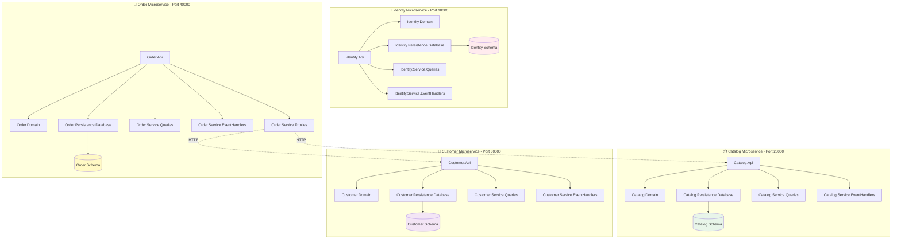

## 🔐 Identity Microservice - Detalle

### Estructura del Proyecto

```
Identity/
├── Identity.Api (Puerto 10000)
│   ├── Controllers/
│   │   └── UserController.cs
│   ├── Startup.cs
│   └── Program.cs
├── Identity.Domain
│   ├── ApplicationUser.cs
│   └── ApplicationRole.cs
├── Identity.Persistence.Database
│   ├── ApplicationDbContext.cs
│   ├── ApplicationDbContextFactory.cs
│   └── Configuration/
├── Identity.Service.Queries
│   └── UserQueryService.cs
└── Identity.Service.EventHandlers
    └── UserEventHandler.cs
```

### Flujo de Autenticación

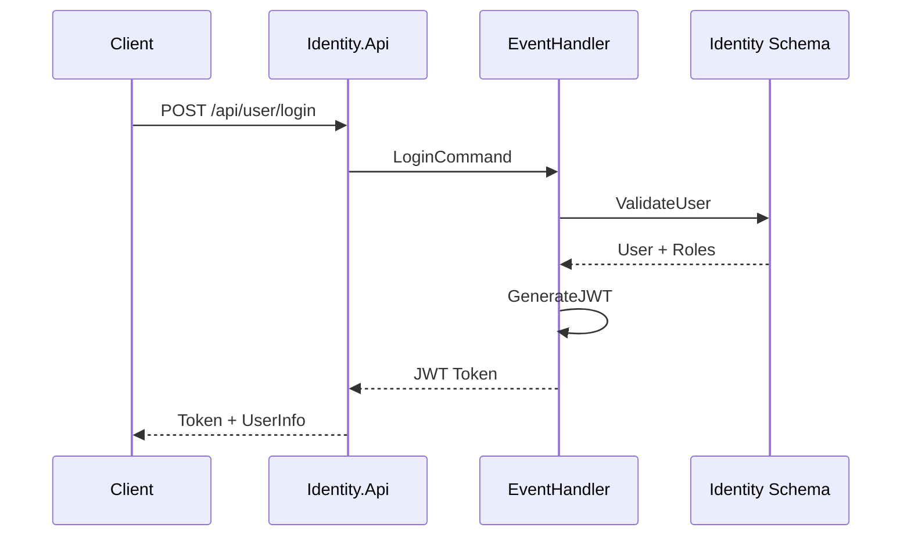

### Endpoints Principales

| Método | Endpoint | Descripción |
|--------|----------|-------------|
| POST | `/api/user/login` | Iniciar sesión |
| POST | `/api/user/register` | Registrar usuario |
| GET | `/api/user/profile` | Obtener perfil |
| PUT | `/api/user/profile` | Actualizar perfil |

## 📦 Catalog Microservice - Detalle

### Estructura del Proyecto

```
Catalog/
├── Catalog.Api (Puerto 20000)
│   ├── Controllers/
│   │   ├── ProductController.cs
│   │   └── StockController.cs
│   └── Startup.cs
├── Catalog.Domain
│   ├── Product.cs
│   └── ProductInStock.cs
├── Catalog.Persistence.Database
│   ├── ApplicationDbContext.cs
│   └── Configuration/
├── Catalog.Service.Queries
│   ├── ProductQueryService.cs
│   └── DTOs/
└── Catalog.Service.EventHandlers
    ├── ProductCreateEventHandler.cs
    └── ProductUpdateStockEventHandler.cs
```

### Flujo de Gestión de Productos

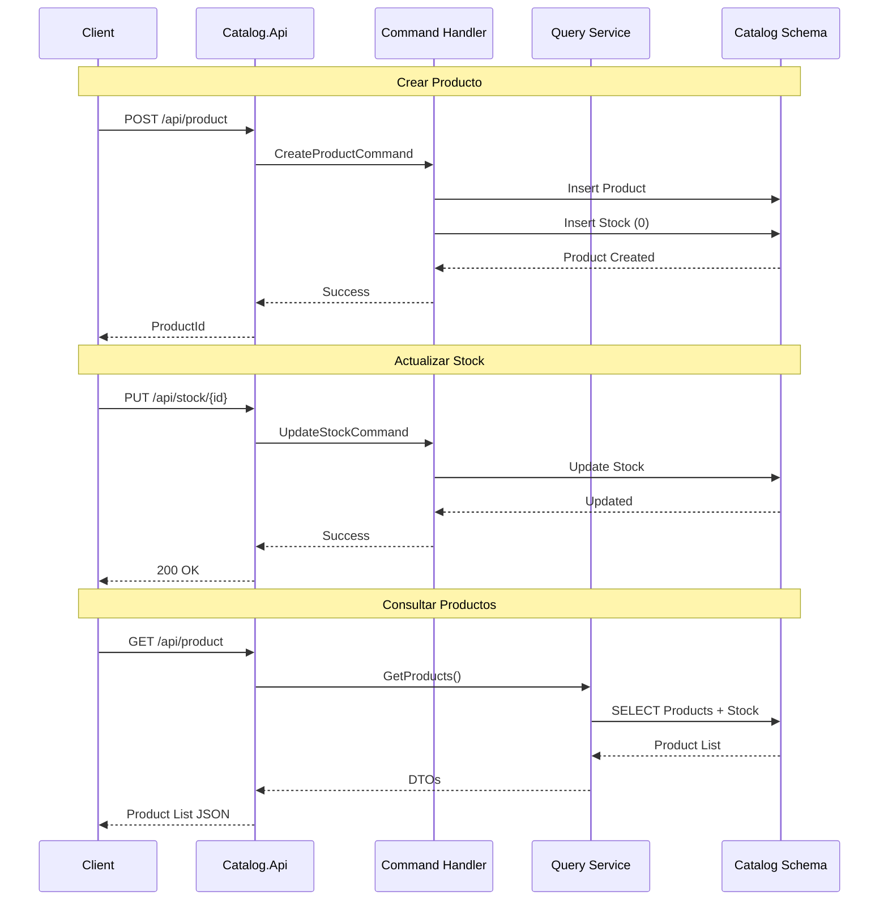

### Endpoints Principales

| Método | Endpoint | Descripción |
|--------|----------|-------------|
| GET | `/api/product` | Listar productos |
| GET | `/api/product/{id}` | Obtener producto |
| POST | `/api/product` | Crear producto |
| PUT | `/api/product/{id}` | Actualizar producto |
| DELETE | `/api/product/{id}` | Eliminar producto |
| PUT | `/api/stock/{productId}` | Actualizar stock |

### Modelo de Dominio

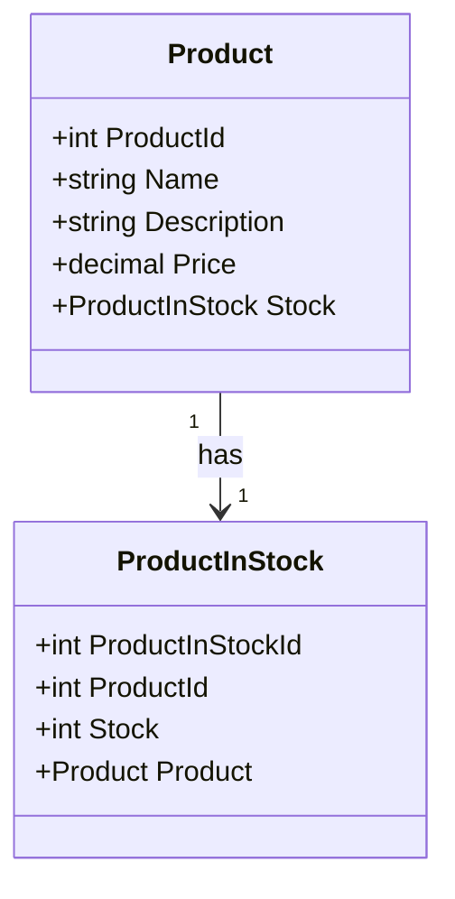

## 👥 Customer Microservice - Detalle

### Estructura del Proyecto

```
Customer/
├── Customer.Api (Puerto 30000)
│   ├── Controllers/
│   │   └── ClientController.cs
│   └── Startup.cs
├── Customer.Domain
│   └── Client.cs
├── Customer.Persistence.Database
│   ├── ApplicationDbContext.cs
│   └── Configuration/
├── Customer.Service.Queries
│   └── ClientQueryService.cs
└── Customer.Service.EventHandlers
    └── ClientEventHandler.cs
```

### Flujo de Gestión de Clientes

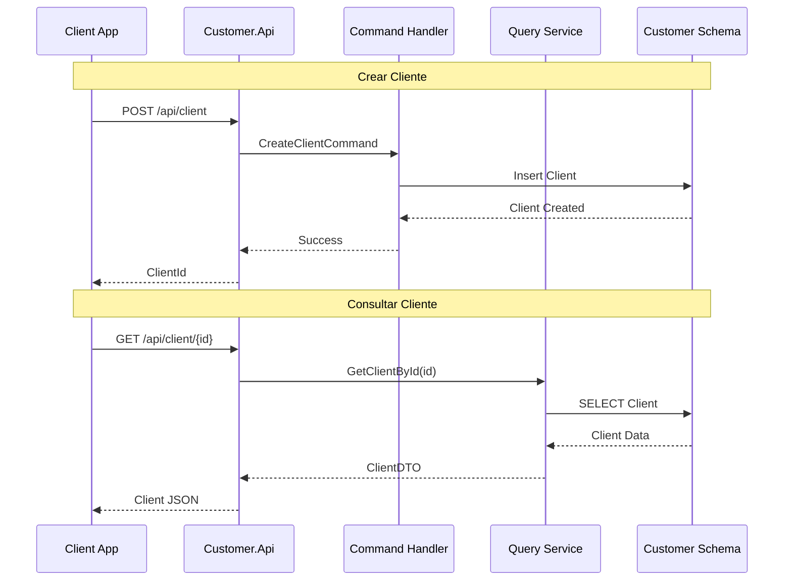

### Modelo de Dominio

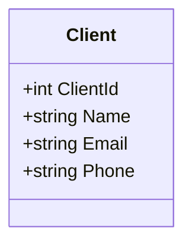

### Endpoints Principales

| Método | Endpoint | Descripción |
|--------|----------|-------------|
| GET | `/api/client` | Listar clientes |
| GET | `/api/client/{id}` | Obtener cliente |
| POST | `/api/client` | Crear cliente |
| PUT | `/api/client/{id}` | Actualizar cliente |

## 🛒 Order Microservice - Detalle

### Estructura del Proyecto

```
Order/
├── Order.Api (Puerto 40000)
│   ├── Controllers/
│   │   └── OrderController.cs
│   └── Startup.cs
├── Order.Domain
│   ├── Order.cs
│   └── OrderDetail.cs
├── Order.Persistence.Database
│   ├── ApplicationDbContext.cs
│   └── Configuration/
├── Order.Service.Queries
│   └── OrderQueryService.cs
├── Order.Service.EventHandlers
│   └── OrderCreateEventHandler.cs
└── Order.Service.Proxies
    ├── CatalogProxy.cs
    └── CustomerProxy.cs
```

### Flujo de Creación de Pedido (Complejo)

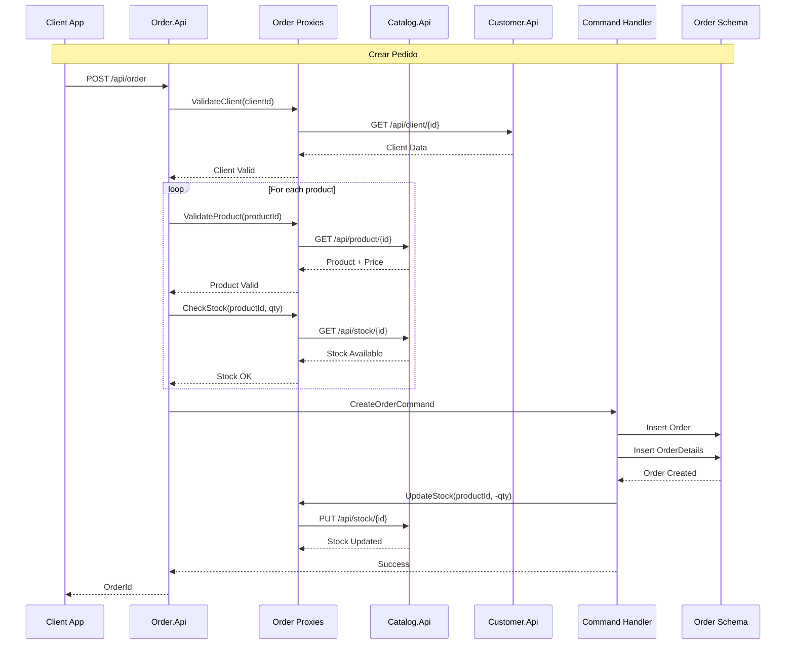

### Modelo de Dominio

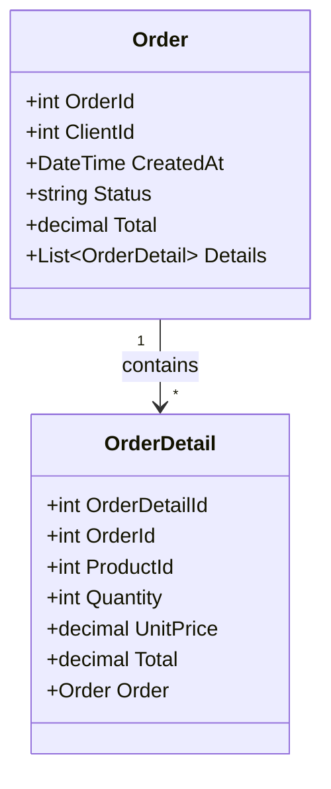

### Endpoints Principales

| Método | Endpoint | Descripción |
|--------|----------|-------------|
| GET | `/api/order` | Listar pedidos |
| GET | `/api/order/{id}` | Obtener pedido |
| POST | `/api/order` | Crear pedido |
| PUT | `/api/order/{id}/status` | Cambiar estado |

### Comunicación Entre Servicios

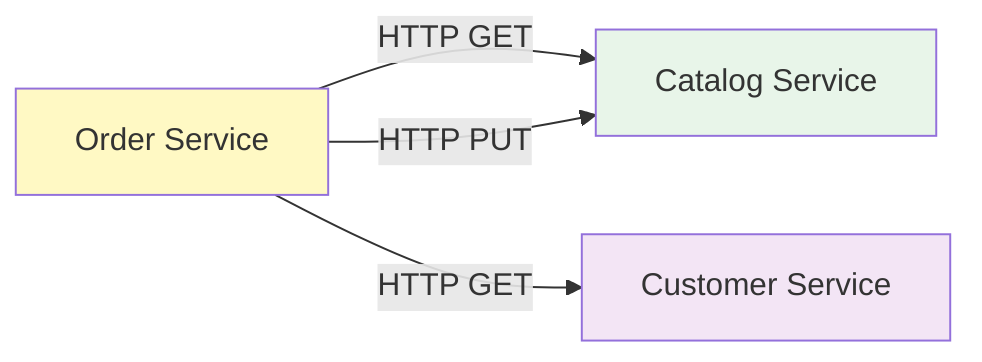

## 🚪 API Gateway

### Estructura

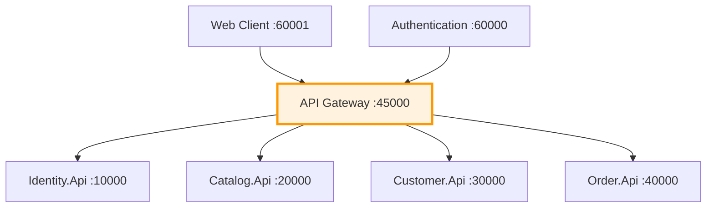

### Proxies del Gateway

```
Api.Gateway.Proxies/
├── CatalogProxy.cs
├── CustomerProxy.cs
├── OrderProxy.cs
└── Config/
    └── ApiUrls.cs
```

### Configuración de Rutas

```json
{
  "ApiUrls": {
    "Identity": "http://localhost:10000",
    "Catalog": "http://localhost:20000",
    "Customer": "http://localhost:30000",
    "Order": "http://localhost:40000"
  }
}
```

## 🔄 Patrón CQRS Implementado

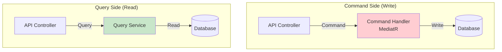

### Ejemplo en Catalog

**Command (Escritura):**
```csharp
// CreateProductCommand
public class CreateProductCommand : IRequest<bool>
{
    public string Name { get; set; }
    public string Description { get; set; }
    public decimal Price { get; set; }
}

// Handler
public class CreateProductHandler : IRequestHandler<CreateProductCommand, bool>
{
    // Escribe en la base de datos
}
```

**Query (Lectura):**
```csharp
// ProductQueryService
public class ProductQueryService
{
    public async Task<List<ProductDto>> GetProducts()
    {
        // Lee de la base de datos
    }
}
```

## 📊 Stack Tecnológico por Capa

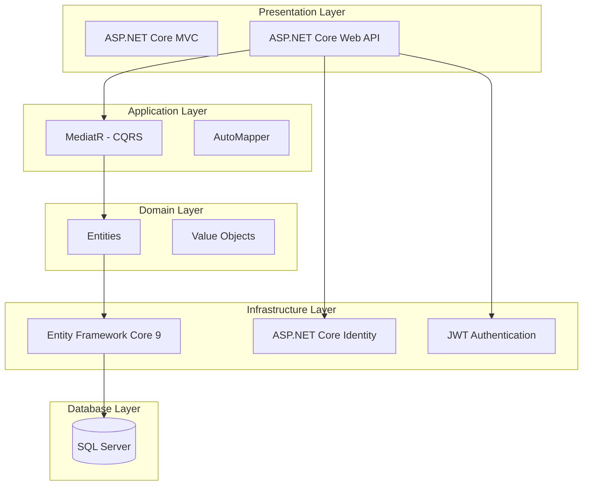

## 🏗️ Clean Architecture

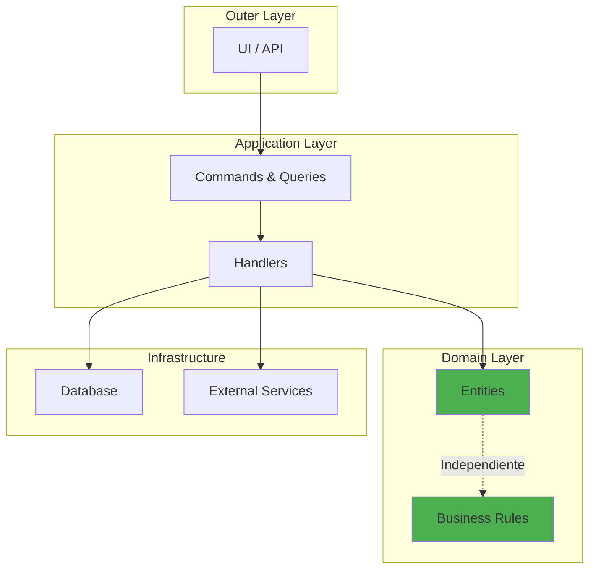

**Principios aplicados:**
- ✅ Domain no depende de infraestructura
- ✅ Flujo de dependencias hacia adentro
- ✅ Business logic aislada
- ✅ Testeable en todos los niveles

## 🎯 Health Checks

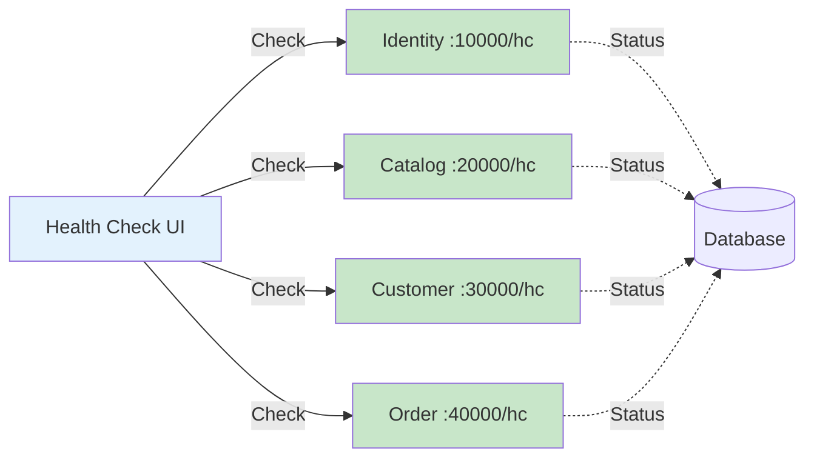

**Endpoints de Health Check:**
- `http://localhost:10000/hc` - Identity
- `http://localhost:20000/hc` - Catalog
- `http://localhost:30000/hc` - Customer
- `http://localhost:40000/hc` - Order

## 📝 Resumen de Puertos

| Servicio | Puerto | Tipo | URL |
|----------|--------|------|-----|
| Identity API | 10000 | Microservicio | http://localhost:10000 |
| Catalog API | 20000 | Microservicio | http://localhost:20000 |
| Customer API | 30000 | Microservicio | http://localhost:30000 |
| Order API | 40000 | Microservicio | http://localhost:40000 |
| API Gateway | 45000 | Gateway | http://localhost:45000 |
| Authentication | 60000 | Cliente | http://localhost:60000 |
| Web Client | 60001 | Cliente | http://localhost:60001 |

---

**📚 Documentación Relacionada:**
- [DATABASE_SCHEMA.md](./DATABASE_SCHEMA.md) - Esquema completo de base de datos
- [DATABASE_DIAGRAM.md](./DATABASE_DIAGRAM.md) - Diagramas simplificados
- [DOCUMENTATION_INDEX.md](./DOCUMENTATION_INDEX.md) - Índice de toda la documentación

**Última actualización:** 2025-10-04
