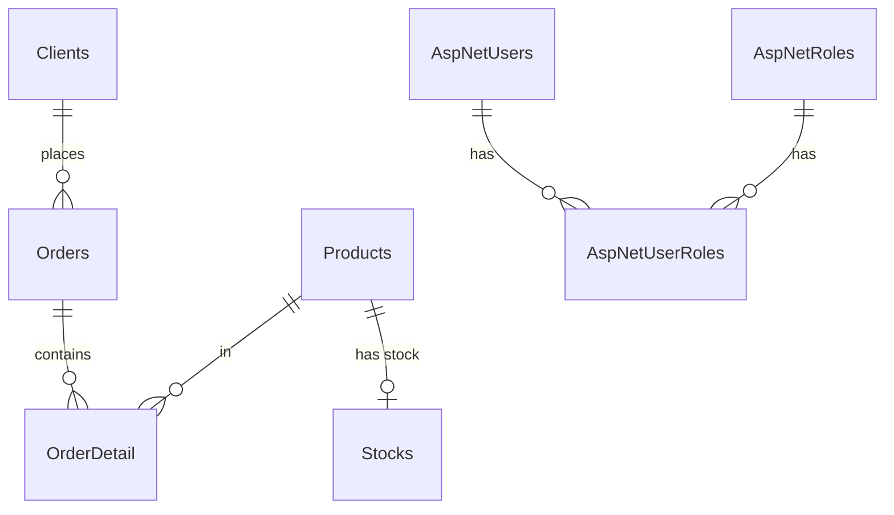
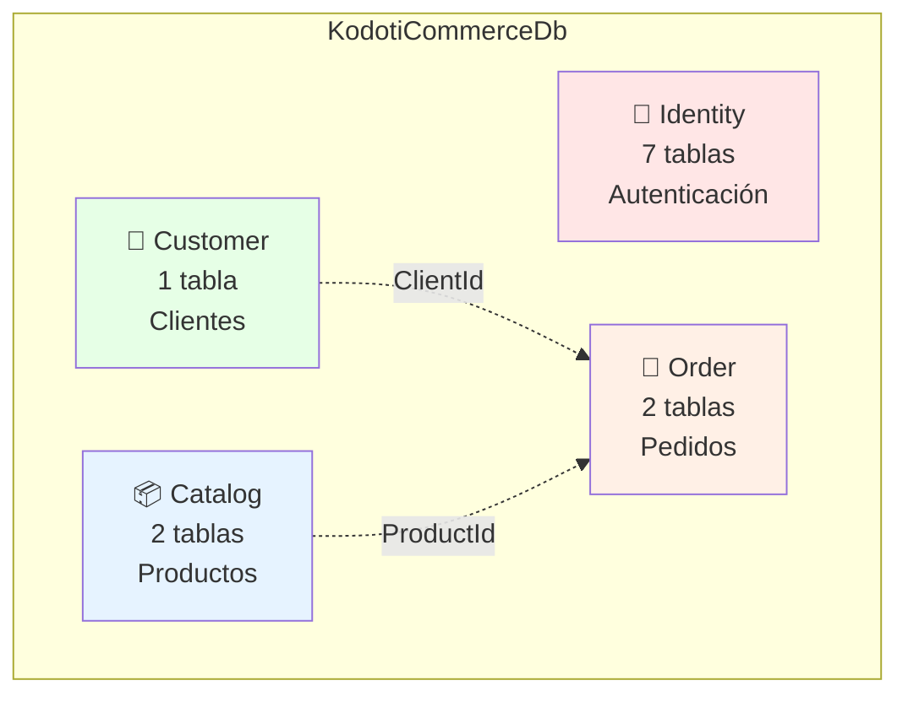
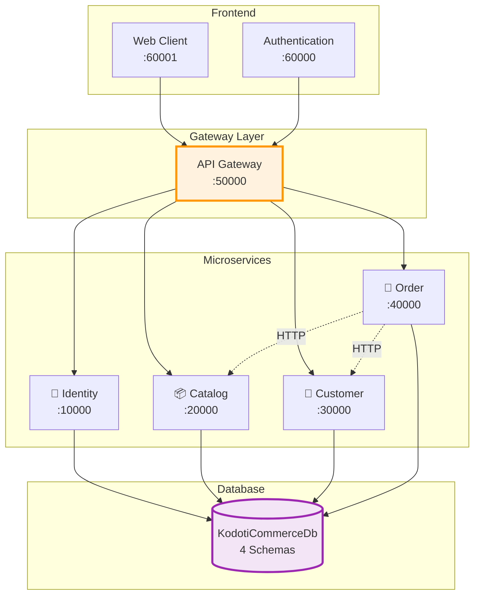
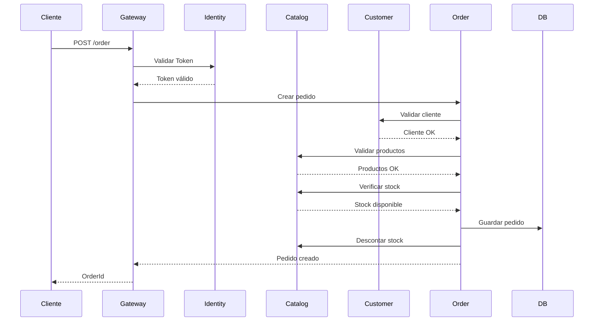
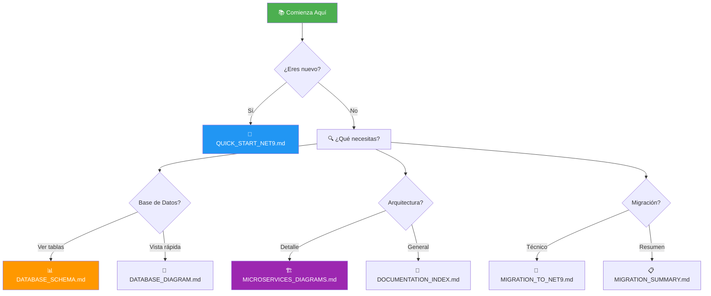

# 🎨 Mapas Visuales - Acceso Rápido

## 🗄️ Esquema de Base de Datos

### Vista Completa con Relaciones

**Ver en:** [DATABASE_SCHEMA.md](./DATABASE_SCHEMA.md)



### Vista Simplificada por Schemas

**Ver en:** [DATABASE_DIAGRAM.md](./DATABASE_DIAGRAM.md)



## 🏗️ Arquitectura de Microservicios

**Ver en:** [MICROSERVICES_DIAGRAMS.md](./MICROSERVICES_DIAGRAMS.md)



## 📊 Tablas por Schema

| Schema | Tablas | Descripción | Microservicio |
|--------|--------|-------------|---------------|
| 🔐 **Identity** | 7 | AspNetUsers, AspNetRoles, AspNetUserRoles, AspNetUserClaims, AspNetRoleClaims, AspNetUserLogins, AspNetUserTokens | Identity.Api |
| 📦 **Catalog** | 2 | Products, Stocks | Catalog.Api |
| 👥 **Customer** | 1 | Clients | Customer.Api |
| 🛒 **Order** | 2 | Orders, OrderDetail | Order.Api |

## 🔄 Flujo de Creación de Pedido



## 🎯 Endpoints Principales por Servicio

### 🔐 Identity Service (Port 10000)

| Método | Endpoint | Acción |
|--------|----------|--------|
| POST | `/api/user/login` | 🔑 Login |
| POST | `/api/user/register` | 📝 Registro |
| GET | `/api/user/profile` | 👤 Perfil |

### 📦 Catalog Service (Port 20000)

| Método | Endpoint | Acción |
|--------|----------|--------|
| GET | `/api/product` | 📋 Listar |
| GET | `/api/product/{id}` | 🔍 Detalle |
| POST | `/api/product` | ➕ Crear |
| PUT | `/api/stock/{id}` | 📊 Actualizar Stock |

### 👥 Customer Service (Port 30000)

| Método | Endpoint | Acción |
|--------|----------|--------|
| GET | `/api/client` | 📋 Listar |
| GET | `/api/client/{id}` | 🔍 Detalle |
| POST | `/api/client` | ➕ Crear |

### 🛒 Order Service (Port 40000)

| Método | Endpoint | Acción |
|--------|----------|--------|
| GET | `/api/order` | 📋 Listar |
| GET | `/api/order/{id}` | 🔍 Detalle |
| POST | `/api/order` | ➕ Crear |

## 📈 Tecnologías por Versión

### Antes (❌ .NET Core 3.1)
```
.NET Core:        3.1
EF Core:          3.1.1
MediatR:          8.0.0
AutoMapper:       9.0.0
JWT:              5.6.0
Health Checks:    3.0.9
```

### Ahora (✅ .NET 9.0)
```
.NET:             9.0
EF Core:          9.0.0
MediatR:          12.4.1
AutoMapper:       13.0.1
JWT:              8.2.1
Health Checks:    8.0.2
```

## 🚀 Inicio Rápido

### 1️⃣ Configurar Base de Datos

**Cadena de Conexión:**
```
Server=localhost\SQLEXPRESS;
Database=KodotiCommerceDb;
Trusted_Connection=True;
MultipleActiveResultSets=true;
TrustServerCertificate=True
```

**Aplicar Migraciones:** ✅ Ya aplicadas

### 2️⃣ Ejecutar Servicios

```powershell
# Terminal 1 - Identity
cd src\Services\Identity\Identity.Api
dotnet run

# Terminal 2 - Catalog
cd src\Services\Catalog\Catalog.Api
dotnet run

# Terminal 3 - Customer
cd src\Services\Customer\Customer.Api
dotnet run

# Terminal 4 - Order
cd src\Services\Order\Order.Api
dotnet run
```

### 3️⃣ Verificar Health Checks

- ✅ http://localhost:10000/hc
- ✅ http://localhost:20000/hc
- ✅ http://localhost:30000/hc
- ✅ http://localhost:40000/hc

### 4️⃣ Credenciales de Prueba

```
Email:    admin@kodoti.com
Password: Pa$$w0rd!
```

## 📚 Documentación Completa

| Documento | Contenido | Icono |
|-----------|-----------|-------|
| [DOCUMENTATION_INDEX.md](./DOCUMENTATION_INDEX.md) | 📑 Índice completo de toda la documentación | 🏠 |
| [DATABASE_SCHEMA.md](./DATABASE_SCHEMA.md) | 🗄️ Diagrama ER completo con relaciones | 📊 |
| [DATABASE_DIAGRAM.md](./DATABASE_DIAGRAM.md) | 🎨 Diagramas simplificados y visuales | 🖼️ |
| [MICROSERVICES_DIAGRAMS.md](./MICROSERVICES_DIAGRAMS.md) | 🏗️ Arquitectura detallada por microservicio | 🔧 |
| [MIGRATION_TO_NET9.md](./MIGRATION_TO_NET9.md) | 📝 Detalles técnicos de migración | 🔄 |
| [QUICK_START_NET9.md](./QUICK_START_NET9.md) | ⚡ Guía rápida de inicio | 🚀 |

## 🎯 Navegación Rápida



## ✅ Estado del Proyecto

| Componente | Estado | Notas |
|------------|--------|-------|
| ✅ Migración a .NET 9 | 100% | 36/36 proyectos |
| ✅ Compilación | Sin errores | 0 warnings críticos |
| ✅ Tests Unitarios | 4/4 pasando | 100% éxito |
| ✅ Base de Datos | Configurada | 13 tablas creadas |
| ✅ Migraciones | Aplicadas | 4/4 servicios |
| ✅ Usuario Admin | Insertado | Credenciales funcionando |
| ✅ Documentación | Completa | 10+ documentos |

## 🎉 ¡Todo Listo!

El proyecto está completamente migrado a .NET 9 y listo para usar. Todos los diagramas se visualizan automáticamente en GitHub gracias a **Mermaid**.

**🔗 Enlaces Útiles:**
- 🏠 [Volver al README](./README.md)
- 📑 [Índice Completo](./DOCUMENTATION_INDEX.md)
- 📊 [Ver Esquema de BD](./DATABASE_SCHEMA.md)

---

**Última actualización:** 2025-10-04  
**Versión:** .NET 9.0  
**Estado:** ✅ Producción Ready
