# WARP.md

This file provides guidance to WARP (warp.dev) when working with code in this repository.

## Project Overview

This is an ECommerce platform built with microservices architecture using .NET 9. The project demonstrates a complete microservices implementation with CQRS, Domain-Driven Design, and clean architecture patterns.

### Architecture Overview

```mermaid
graph TB
    Client[🌐 Web Client :60001]
    Auth[🔐 Authentication :60000] 
    Gateway[🚪 API Gateway :45000]
    
    Identity[🔑 Identity API :10000]
    Catalog[📦 Catalog API :20000]
    Customer[👥 Customer API :30000]
    Order[🛒 Order API :40000]
    
    DB[(💾 SQL Server ECommerceDb)]
    
    Client --> Gateway
    Auth --> Gateway
    Gateway --> Identity
    Gateway --> Catalog
    Gateway --> Customer
    Gateway --> Order
    
    Identity --> DB
    Catalog --> DB
    Customer --> DB
    Order --> DB
```



The solution contains **36 projects** organized into:
- **4 Microservices** (Identity, Catalog, Customer, Order)
- **Each service follows Clean Architecture**: API → Services → Persistence → Domain
- **API Gateway** for request routing
- **2 Client applications** (Web Client + Authentication)
- **Shared libraries** for common functionality

## Common Development Commands

### Building and Running

```powershell
# Build entire solution
dotnet build

# Restore packages 
dotnet restore

# Run specific microservice (choose one)
cd src/Services/Identity/Identity.Api && dotnet run
cd src/Services/Catalog/Catalog.Api && dotnet run  
cd src/Services/Customer/Customer.Api && dotnet run
cd src/Services/Order/Order.Api && dotnet run

# Run in watch mode (auto-reload on changes)
dotnet watch run

# Run with specific port
dotnet run --urls "https://localhost:10000"
```

### Database Operations

Each microservice has its own database context. Run migrations from the API project directory:

```powershell
# Identity Service
cd src/Services/Identity/Identity.Api
dotnet ef database update --context ApplicationDbContext

# Catalog Service  
cd src/Services/Catalog/Catalog.Api
dotnet ef database update --context ApplicationDbContext

# Customer Service
cd src/Services/Customer/Customer.Api
dotnet ef database update --context ApplicationDbContext

# Order Service
cd src/Services/Order/Order.Api
dotnet ef database update --context ApplicationDbContext

# Create new migration (from persistence project)
cd src/Services/Identity/Identity.Persistence.Database
dotnet ef migrations add MigrationName
```

### Testing

```powershell
# Run all tests
dotnet test

# Run specific test project
dotnet test src/Services/Catalog/Catalog.Tests/Catalog.Tests.csproj

# Run with detailed output
dotnet test --verbosity detailed

# Run with coverage
dotnet test /p:CollectCoverage=true
```

### Health Checks

Each service exposes health check endpoints:

```powershell
# Check service health (PowerShell)
$services = @(10000, 20000, 30000, 40000)
foreach ($port in $services) {
    try {
        $response = Invoke-WebRequest -Uri "https://localhost:$port/hc" -UseBasicParsing
        Write-Host "Port $port : $($response.StatusCode) - OK" -ForegroundColor Green
    } catch {
        Write-Host "Port $port : ERROR" -ForegroundColor Red
    }
}
```

## Architecture Patterns

### CQRS with MediatR
- **Commands**: Modify data (Create, Update, Delete)
- **Queries**: Read data 
- **Handlers**: Process commands and queries
- All communication goes through MediatR pipeline

### Domain-Driven Design (DDD)
- Each microservice has its own bounded context
- **Domain Models**: Core business logic
- **Repositories**: Data access abstraction
- **Services**: Business logic orchestration

### Project Structure Per Microservice
```
Services/[ServiceName]/
├── [ServiceName].Api/              # Web API controllers, startup
├── [ServiceName].Domain/           # Domain entities, aggregates
├── [ServiceName].Persistence.Database/  # EF DbContext, migrations
├── [ServiceName].Service.EventHandlers/ # Command handlers  
├── [ServiceName].Service.Queries/  # Query handlers
├── [ServiceName].Service.Proxies/  # HTTP clients to other services
├── [ServiceName].Common/           # Shared DTOs, mappings
└── [ServiceName].Tests/            # Unit tests
```

### Inter-Service Communication
- **Synchronous**: HTTP REST calls via service proxies
- **Authentication**: JWT tokens passed between services
- **Gateway Pattern**: All external requests go through API Gateway
- **Service Discovery**: Hardcoded URLs in appsettings (for simplicity)

## Database Schema

The project uses **SQL Server** with separate schemas per microservice:

| Schema | Tables | Purpose | Microservice |
|--------|---------|----------|--------------|
| `Identity` | 7 | Users, roles, claims | Identity.Api :10000 |
| `Catalog` | 2 | Products, stock | Catalog.Api :20000 |
| `Customer` | 1 | Customer data | Customer.Api :30000 |
| `Order` | 2 | Orders, order details | Order.Api :40000 |

**Connection String**: `Server=localhost\\SQLEXPRESS;Database=ECommerceDb;Trusted_Connection=True;MultipleActiveResultSets=true;TrustServerCertificate=True`

**Default User**: admin@gmail.com / Pa$$w0rd!

## Service Ports

| Service | Port | Purpose |
|---------|------|---------|
| Identity.Api | 10000 | Authentication & user management |
| Catalog.Api | 20000 | Product catalog & inventory |
| Customer.Api | 30000 | Customer information |
| Order.Api | 40000 | Order processing |
| Api.Gateway.WebClient | 45000 | Request routing |
| Clients.Authentication | 60000 | Login interface |
| Clients.WebClient | 60001 | Main web application |

## Key Technologies

- **.NET 9.0** - Latest framework version
- **Entity Framework Core 9.0** - ORM with Code First migrations
- **ASP.NET Core Identity** - Authentication & authorization
- **MediatR 12.4.1** - CQRS pattern implementation
- **AutoMapper** - Object-to-object mapping
- **JWT Bearer Authentication** - Token-based security
- **Health Checks** - Service monitoring
- **MSTest** - Unit testing framework

## Development Workflow

### Starting Development Environment

1. **Start SQL Server** (LocalDB or Express)
2. **Update connection strings** in each service's `appsettings.json`
3. **Run migrations** for all services
4. **Start services** in order: APIs first, then Gateway, then Clients

### Making Changes

1. **Domain Changes**: Start with Domain projects, then update Persistence
2. **API Changes**: Add/modify controllers in API projects
3. **Business Logic**: Update Command/Query handlers in Service projects
4. **Database Changes**: Create migrations in Persistence projects
5. **Testing**: Run unit tests, especially after domain changes

### Debugging Tips

- **Logs**: Check console output from each service
- **Health Checks**: Use `/hc` endpoints to verify service status
- **JWT Tokens**: Decode tokens to troubleshoot authentication issues
- **Database**: Use SQL Server Management Studio or Azure Data Studio

## Common Issues

### Port Conflicts
If ports are in use, modify `launchSettings.json` in each API project's Properties folder.

### Database Connection Issues
- Verify SQL Server is running: `Get-Service | Where-Object {$_.Name -like "*SQL*"}`
- For LocalDB: `sqllocaldb start mssqllocaldb`
- Check connection strings match your SQL Server instance

### Authentication Issues
- Ensure JWT secret keys are consistent across services
- Verify token expiration times
- Check CORS settings if making cross-origin requests

### Missing References
After pulling changes, always run:
```powershell
dotnet restore
dotnet build
```

## References

- **Full Documentation**: See `DOCUMENTATION_INDEX.md` for complete documentation map
- **Quick Start**: See `QUICK_START_NET9.md` for detailed setup instructions
- **Commands Reference**: See `CHEAT_SHEET.md` for extensive command reference
- **Database Schema**: See `DATABASE_SCHEMA.md` for complete ER diagrams
- **Migration Notes**: See `MIGRATION_TO_NET9.md` for upgrade details